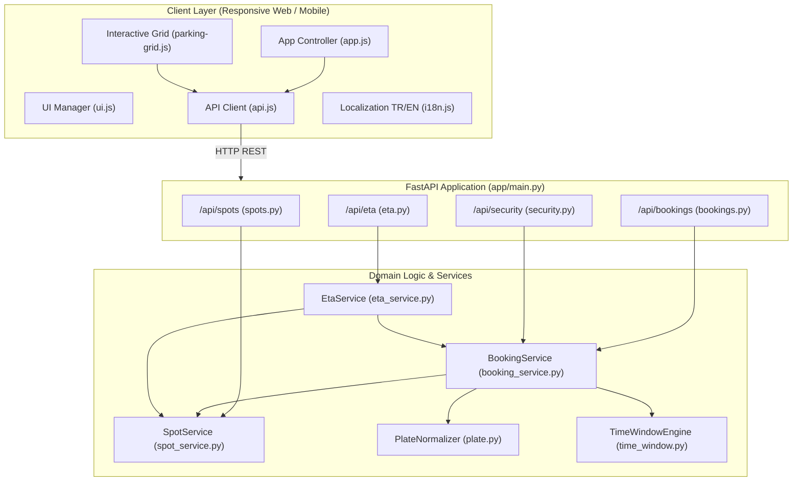
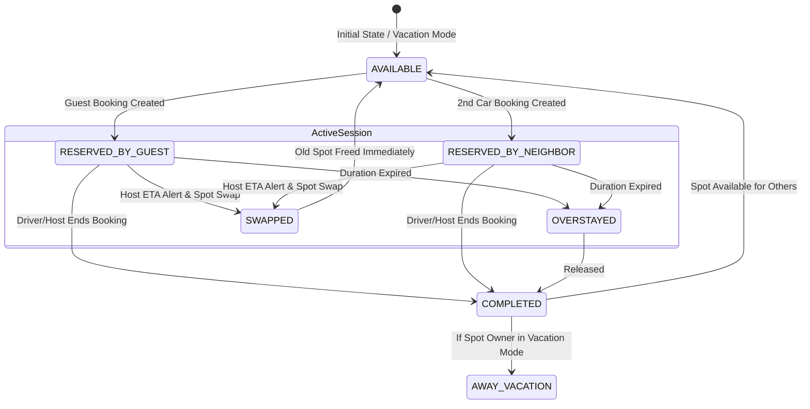
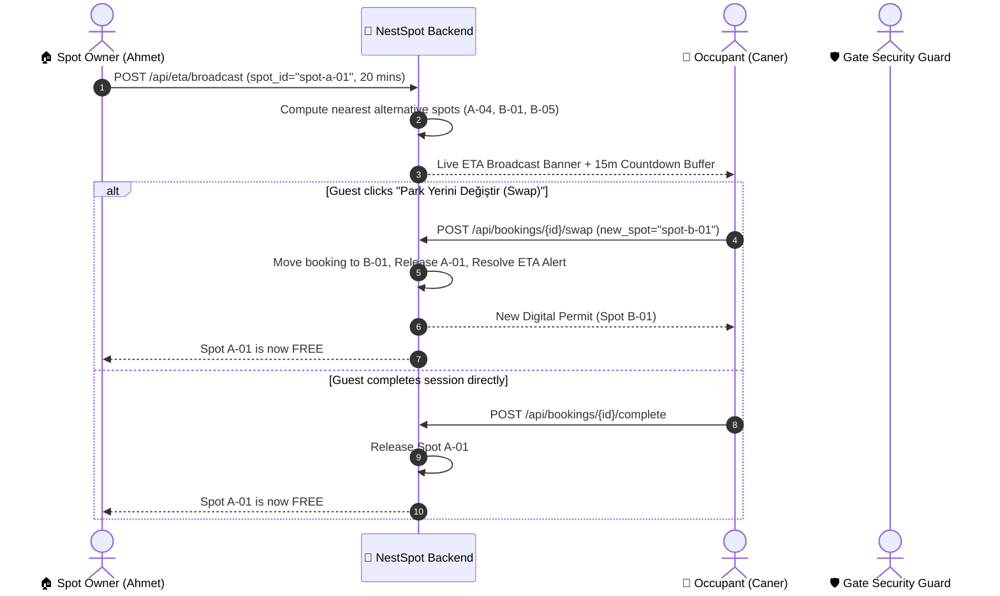
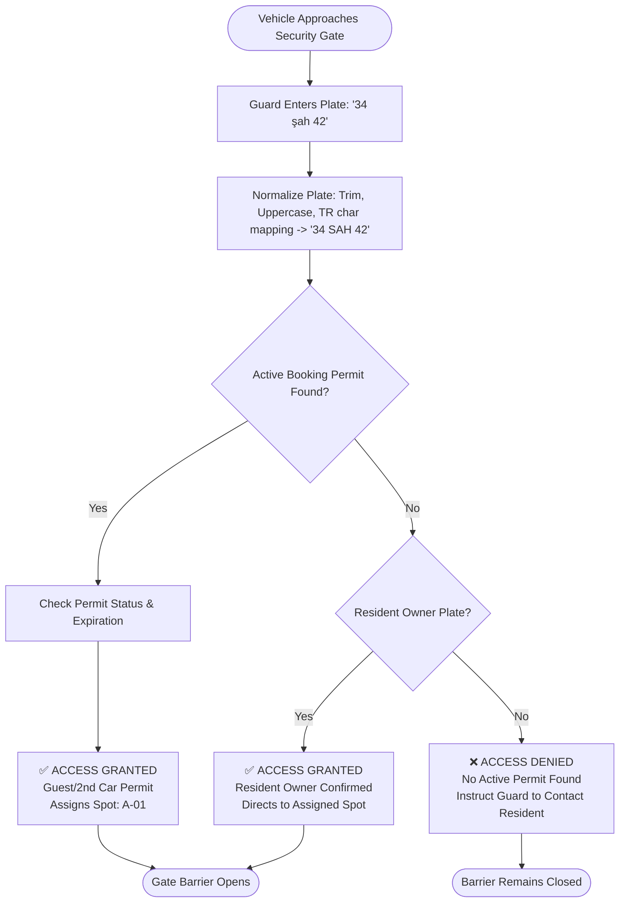

# NestSpot Architecture & Engineering Specification

**NestSpot** is a residential peer-to-peer parking sharing platform designed for gated residential complexes and apartment buildings. It enables neighbors to share allocated private parking slots during away hours and vacations, validates guest permits at the security gate, and coordinates real-time resident returns with automated buffer countdowns and spot swaps.

---

## 🏛️ System Architecture Overview

---

## 🔄 1. Reservation & Guest Pass Lifecycle

A resident can book a neighbor's vacant spot for a 2nd family car or a visiting guest.

---

## ⚡ 2. Live ETA Departure & Spot Swap Protocol

When a spot owner leaves the office and heads home, they broadcast an ETA alert (`15`, `20`, `30`, `45` min). The occupant receives a live countdown buffer and can either release or execute a 1-click spot swap to an alternative free spot.

---

## 🛡️ 3. Security Gate License Plate Verification Flow

Guards at the apartment entrance scan or enter approaching vehicle plates. The system normalizes Turkish characters and punctuation, matches active permits and registered resident vehicles.

---

## ⏰ 4. Time Window & Conflict Resolution Matrix

- **Overnight Schedules (`22:00 - 06:00`)**: Evaluated by splitting into dual interval segments `[22:00, 24:00)` and `[00:00, 06:00)`.
- **Interval Collision Rule**: `start_a < end_b AND start_b < end_a` (Half-open intervals `[start, end)` avoid boundary collisions).
- **Plate Normalization Table**:
  | Raw Input | Normalized Key |
  |---|---|
  | `34 abc 123` | `34ABC123` |
  | `34-ıjk-99` | `34IJK99` |
  | `06  şah  42` | `06SAH42` |
  | `35 ÖZ 707` | `35OZ707` |

---

## 🔒 5. Concurrency & Data Guarantees
- In-memory thread-safe state operations.
- Dynamic auto-expiration of completed and stale ETA alerts and bookings upon read.
- Idempotent resolution endpoints with atomic spot status updates.
